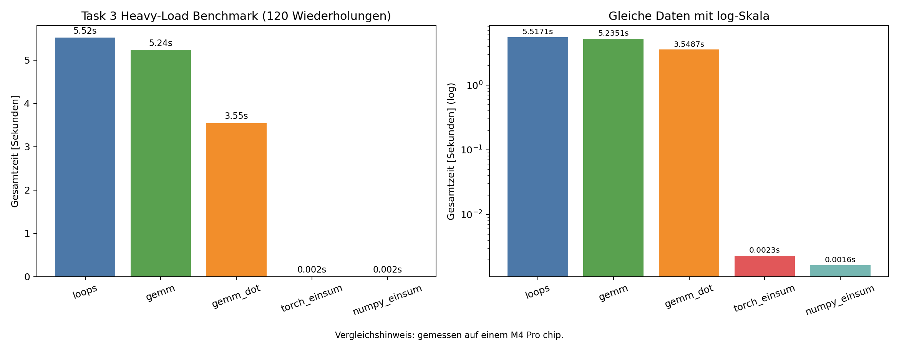

Task 3: Einsum ``acsxp, bspy -> abcxy``
=======================================

Aufgabenstellung
----------------

Die Einsum-Operation soll in zwei Pflichtvarianten umgesetzt werden:

1. komplette Schleifenlösung über alle benötigten Indizes,
2. GEMM-Variante mit Wiederverwendung einer Matrixmultiplikation aus Task 2.

Zusätzlich haben wir eine dritte Variante nur für den
geschwindigkeitsbezogenen Vergleich aufgenommen.

Implementierte Funktionen
-------------------------

.. literalinclude:: ../../../../assignments/01_assignment/src/assignment_01.py
   :language: python
   :pyobject: einsum_loops

.. literalinclude:: ../../../../assignments/01_assignment/src/assignment_01.py
   :language: python
   :pyobject: einsum_gemm

.. literalinclude:: ../../../../assignments/01_assignment/src/assignment_01.py
   :language: python
   :pyobject: einsum_gemm_dot

Unsere Lösung
-------------

``einsum_loops`` rechnet die Formel direkt über alle Indizes aus.
``einsum_gemm`` summiert über ``s`` und verwendet im Inneren die 2D-Multiplikation.
``einsum_gemm_dot`` ist nur ein Zusatz für Benchmark-Vergleiche
(keine extra Pflichtanforderung aus der Aufgabenstellung).
Dass ``einsum_gemm_dot`` in unserem Lauf spürbar schneller ist, liegt vor allem an weniger Python-Overhead im inneren Rechenschritt (1D-Dot-Aufruf statt sehr vieler einzelner 2D-Indexzugriffe); je nach Hardware und Tensorgröße kann sich dieses Verhältnis aber auch ändern.

Benchmark-Visualisierung
------------------------

Der Plot zeigt den Vergleich auf Sekundenbasis für ``loops``, ``gemm``,
``gemm_dot``, ``torch_einsum`` und ``numpy_einsum``.
