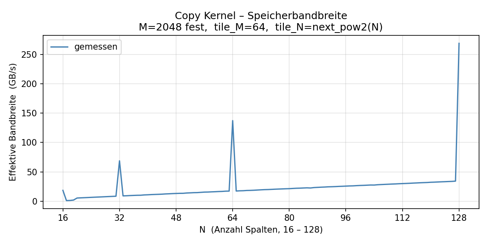
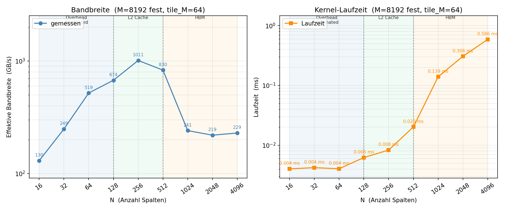

Task 4: Benchmarking Bandwidth
===============================

Aufgabenstellung
----------------

**a)** Ein cuTile-Kernel soll eine 2D-Matrix der Form ``(M, N)`` kacheln
und kopieren. Jedes Kernel-Programm ist für ein Tile der Größe
``(tile_M, tile_N)`` zuständig.

**b)** Die Bandbreite wird für ``M=2048`` und **alle** ``N ∈ {16, …, 128}``
gemessen. Das Tile deckt immer die volle Breite ab (``tile_N = N``).
Da cuTile nur Tile-Dimensionen als Zweierpotenzen unterstützt, wird intern
``tile_N = next_pow2(N)`` verwendet und das Array entsprechend gepaddet.
Die Formel lautet:

.. code-block:: text

   bandwidth (GB/s) = 2 * M * N * sizeof(element) / (time_s * 1e9)

Teil a – Copy-Kernel
--------------------

Implementierter Kernel
^^^^^^^^^^^^^^^^^^^^^^

.. literalinclude:: ../../../../assignments/02_assignment/src/task4.py
   :language: python
   :pyobject: copy_tile

.. literalinclude:: ../../../../assignments/02_assignment/src/task4.py
   :language: python
   :pyobject: launch_copy

Unsere Lösung
^^^^^^^^^^^^^

Der Kernel liest ein ``(tile_M, tile_N)``-Tile aus der Eingabematrix
und schreibt es direkt in die Ausgabe.
Das 2D-Grid ergibt sich aus ``ceil(M / tile_M)`` mal ``ceil(N / tile_N)``.
Da cuTile ausschließlich Zweierpotenzen als Tile-Größe unterstützt, rundet
``launch_copy`` die Tile-Dimensionen auf die nächste Zweierpotenz auf und
paddet das Array entsprechend — der gültige Bereich wird nach dem Kernel-Aufruf
zurückkopiert. Die Korrektheit wurde mit ``cp.allclose`` für Zweierpotenzen
sowie für nicht-zweierpotenz-ausgerichtete Formen (500×70, 1000×96) verifiziert.

Teil b – Bandwidth-Sweep
-------------------------

Implementierung
^^^^^^^^^^^^^^^

.. literalinclude:: ../../../../assignments/02_assignment/src/task4.py
   :language: python
   :pyobject: bench_kernel

.. literalinclude:: ../../../../assignments/02_assignment/src/task4.py
   :language: python
   :pyobject: task4b

Programmausgabe
^^^^^^^^^^^^^^^

.. literalinclude:: ../../../../assignments/02_assignment/out/task4/task4.log
   :language: text

Auswertung
^^^^^^^^^^

Gemessen auf dem DGX Spark (CUDA 13.0), je 50 Runs nach 5 Warmup-Durchläufen.

Der Plot zeigt zwei überlagerte Effekte:

**Spitzen bei Zweierpotenzen (N = 16, 32, 64, 128):**
An diesen Stellen gilt ``tile_N = next_pow2(N) = N`` exakt — kein Padding
nötig, der Kernel kopiert präzise die geforderten Daten ohne Verschwendung.
Die Laufzeit sinkt auf ~4–7 µs (gegenüber ~30 µs für alle anderen N),
was zu Bandbreiten von 69–269 GB/s führt. Bei nicht-zweierpotenz-ausgerichteten
N hingegen wird ein übergroßes Tile kopiert (z. B. N=17 → tile_N=32),
was die effektiv genutzte Speicherbandbreite für die eigentlichen Nutzdaten
drastisch reduziert.

**Kontinuierlicher Anstieg der Bandbreite zwischen den Spitzen:**
Innerhalb eines Zweierpotenz-Intervalls (z. B. N=33..63) bleibt die
Tile-Größe konstant (tile_N=64), sodass die Kernel-Laufzeit nahezu
unverändert bei ~30 µs liegt. Die tatsächliche Datenmenge ``2·M·N·2 Byte``
wächst jedoch linear mit N — bei konstantem Nenner steigt die berechnete
Bandbreite deshalb proportional zu N an.

Zusatz: Erweiterter Sweep *(nicht Teil der Bewertung)*
-------------------------------------------------------

Um das Overhead-Regime sichtbar von echtem HBM-Zugriff abzugrenzen,
wurde derselbe Kernel zusätzlich für ``M=8192`` und
``N ∈ {16, 32, 64, 128, 256, 512, 1024, 2048, 4096}`` gemessen.

.. literalinclude:: ../../../../assignments/02_assignment/out/task4_bonus_test/task4_bonus_test.log
   :language: text

Der Plot zeigt log-skaliert drei klar trennbare Regime:
Overhead-dominiert (N ≤ 128, konstante Laufzeit ~0.004 ms),
L2-Cache (N = 256–512, Bandbreite bis ~1010 GB/s)
und HBM (N ≥ 1024, stabile ~220–240 GB/s).

