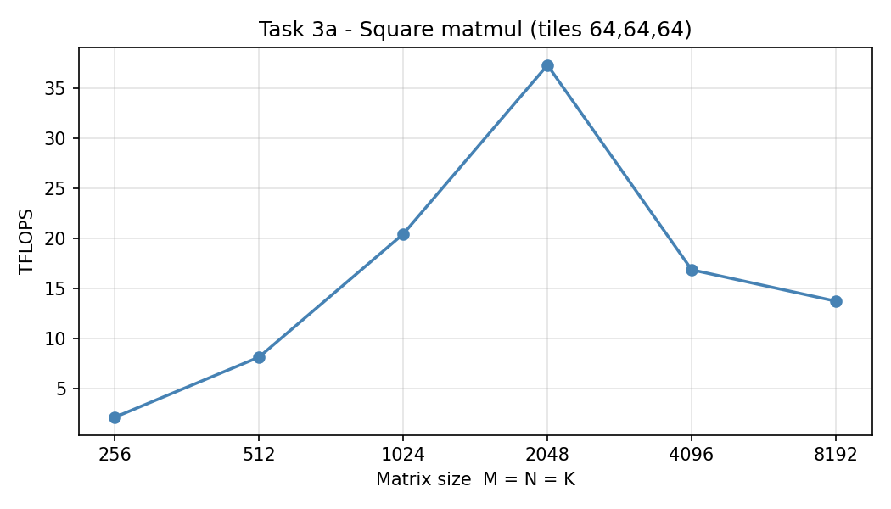
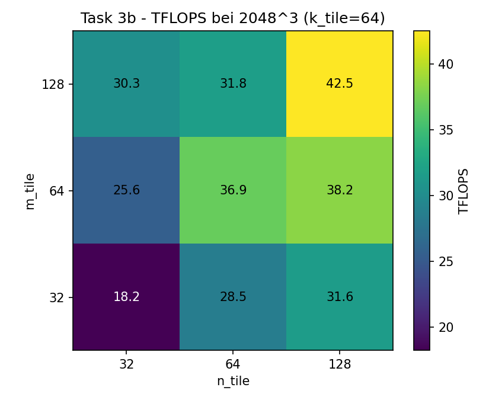
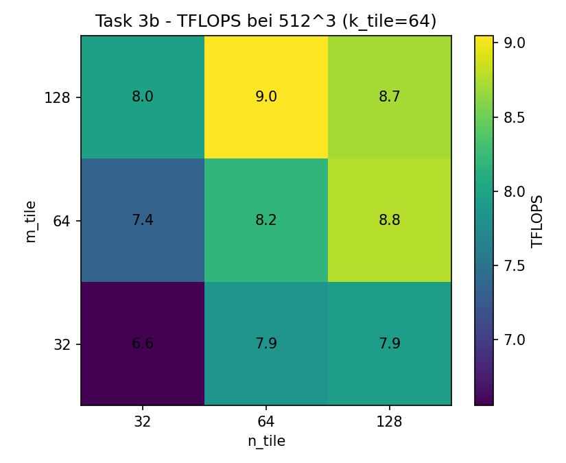

Task 3: Benchmarking the Matrix Multiplication Kernel
======================================================

Aufgabenstellung
----------------

Der Kernel aus Task 2 wird gebenchmarkt. Performance wird in **TFLOPS**
reported, berechnet als

.. code-block:: text

   TFLOPS = 2 * M * N * K / (t_s * 1e12)

**a)** Square Matmul mit Tile-Größe ``(64, 64, 64)`` für
``M = N = K ∈ {256, 512, 1024, 2048, 4096, 8192}``. Plot der TFLOPS und
Beobachtungen.

**b)** Bei Matrixgrößen ``2048³`` und ``512³`` werden alle 27 Kombinationen
von ``m_tile, n_tile, k_tile ∈ {32, 64, 128}`` durchgemessen. Visualisierung
als Heatmap mit ``m_tile`` und ``n_tile`` auf den Achsen, ``k_tile = 64``
fixiert. Beste Tile-Kombi reporten.

Benchmark-Setup
---------------

Vor jeder Messung laufen 3 manuelle Warmups, damit der cuTile-JIT nicht in
die Messung reinläuft. Die eigentliche Messung übernimmt
``triton.testing.do_bench`` mit ``warmup=25`` und ``rep=200`` (also
nochmal ~25 ms warmup und ~200 ms Wiederholungs-Messung intern):

.. code-block:: python

   def bench(M, N, K, mt, nt, kt):
       A = torch.randn((M, K), dtype=torch.float16, device='cuda')
       B = torch.randn((K, N), dtype=torch.float16, device='cuda')
       fn = lambda: matmul(A, B, mt, nt, kt)

       for _ in range(3):
           fn()
       torch.cuda.synchronize()

       return triton.testing.do_bench(fn, warmup=25, rep=200)

Die TFLOPS-Formel aus der Aufgabe ist als kleiner Helper implementiert:

.. code-block:: python

   def tflops(M, N, K, ms):
       sec = ms * 1e-3
       return (2.0 * M * N * K) / sec / 1e12

Gemessen wurde auf dem DGX Spark (NVIDIA GB10, Blackwell, CUDA 13.0).

Vollständige Implementierung
----------------------------

.. literalinclude:: ../../../../assignments/03_assignment/src/task3.py
   :language: python

Teilaufgabe a) – Square Matmul Sweep
-------------------------------------

Die Kurve hat ihren Peak bei ``2048`` mit ~37 TFLOPS und fällt für 4096 /
8192 wieder ab. Die drei Regime sind aber gut über die GPU-Architektur
erklärbar:

* **256, 512 (launch-/overhead-bound):**
  Bei 256³ entstehen mit ``(64,64,64)`` Tiles nur ``4 × 4 = 16`` Blöcke –
  zu wenig, um die SMs des GB10 voll auszulasten (Folie 2). Die Kernel-
  Laufzeit ist außerdem so kurz (~16 µs), dass Launch-Overhead nicht
  vernachlässigbar ist.

* **1024, 2048 (Sweet Spot, L2-Cache-Reuse):**
  Bei 2048³ sind es ``32 × 32 = 1024`` Blöcke, gleichmäßig verteilbar.
  Das aktive Working-Set passt noch in die ~25 MB L2 vom GB10 (haben
  wir in Assignment 02 Task 1 ausgelesen), das heißt wiederverwendete
  A/B-Tiles werden aus L2 statt aus HBM geliefert – das ist das
  "FLOPs / Bytes fetched from HBM"-Maß aus Folie 37.

* **4096, 8192 (HBM-bandwidth-bound):**
  Bei 8192³ gibt es ``128 × 128 = 16384`` Blöcke. Eine Block-Zeile von
  ``A`` allein ist ``8192 × 8192 × 2 Byte = 128 MB``, also weit über
  L2-Größe. Mit dem row-major-Scheduling (Folien 23–33) müssen viele
  Tiles nachgeladen werden – wir sind nicht mehr Compute-bound sondern
  HBM-bound. Genau das ist die Motivation für Task 4 (Block Swizzling,
  Folie 36): bei naivem Mapping liegen 42 Blöcke aktiv im L2, beim
  swizzlten Layout nur 36 (Folien 35–36).

Teilaufgabe b) – Tile Shape Sweep
----------------------------------

Bei ``2048³``
^^^^^^^^^^^^^

Beste Konfiguration: ``(128, 128, 64)`` mit **42.50 TFLOPS**.

Größere Tiles in M/N gewinnen klar. Hintergrund ist die **arithmetische
Intensität**: pro Output-Tile macht der Kernel ``2 · m · n · K`` FLOPs,
lädt aber nur ``(m + n) · K · 2 Byte``. Das Verhältnis FLOPs / Bytes wächst
also mit größeren Tiles. Genau deswegen unterstützen neuere Architekturen
auch immer größere Max-MMA-Shapes (Folie 9: Volta ``m8n8k4`` → Hopper
``m64n256k16`` → Blackwell ``m256n256k16``).

``(128, 128, 128)`` bricht aber wieder ein (19.6 TFLOPS) – Akku + zwei
Input-Tiles werden vermutlich zu groß für Shared Memory / Register File
(Folie 3) und die Occupancy droppt.

Bei ``512³``
^^^^^^^^^^^^

Beste Konfiguration: ``(128, 64, 32)`` mit **9.11 TFLOPS**.

Bild ist viel flacher (alle Werte zwischen ~6 und ~9 TFLOPS). Die Matrix
ist klein genug, dass das Working-Set sowieso komplett in L2 passt – wir
sind hier eher launch-/scheduling-bound als memory-bound. Größere Tiles
helfen weniger, und ``(128,128,128)`` hat sogar nur 16 Blöcke total, das
reicht nicht mehr für gleichmäßige SM-Auslastung.

Zusammenfassung
---------------

* **Beste Tile-Konfiguration @ 2048³:** ``(128, 128, 64)`` → 42.50 TFLOPS
* **Beste Tile-Konfiguration @ 512³:**  ``(128, 64, 32)``  →  9.11 TFLOPS

Der Einbruch in 3a bei 4096/8192 zeigt sehr direkt, warum Block Swizzling
in Task 4 nötig ist – die ~14 TFLOPS bei 8192³ liegen weit unter dem,
was die Tensor Cores leisten könnten.

Programmausgabe
---------------

.. literalinclude:: ../../../../assignments/03_assignment/out/task3/task3_log.txt
   :language: text
