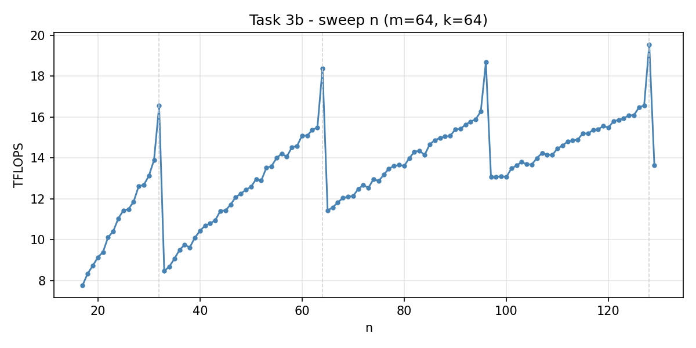
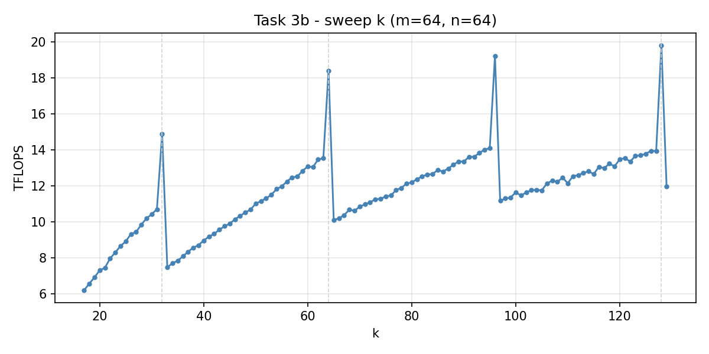

Task 3: GEMM Dimension Size Sweep
==================================

Aufgabenstellung
----------------

**a)** Contraction-Kernel für ``ackm, bcnk -> abnm``. Fix:
``|a| = 16``, ``|b| = 16``, ``|c| = 32``. ``m, n, k`` beliebig.

**b)** Sweeps mit ``triton.testing.do_bench``:

1. ``|k| = |m| = 64``, ``n`` von **17 bis 129**
2. ``|m| = |n| = 64``, ``k`` von **17 bis 129**

Klassifikation der Indizes
--------------------------

Nach Folie 8:

==========  =====================  =====================  ============
Typ         A (``ackm``)           B (``bcnk``)           C (``abnm``)
==========  =====================  =====================  ============
**M**       ``a, m``               –                      ``a, m``
**N**       –                      ``b, n``               ``b, n``
**K**       ``c, k``               ``c, k``               –
==========  =====================  =====================  ============

Keine Batch-Dimension. Pro CTA wird ein ``(n_tile, m_tile)``-Output-Tile
berechnet, die K-Reduktion läuft über ``c`` und ``k``.

Lösung
------

Kernel
^^^^^^

Pro ``(a, b, n_block, m_block)`` ein CTA. ``c`` und ``k`` werden im
Kernel sequenziell geloopt:

.. code-block:: python

   acc = ct.zeros((n_tile, m_tile), dtype=ct.float32)

   for c_i in range(C_SIZE):
       for k_i in range(num_k_blocks):
           a_tile = ct.load(A, index=(pid_a, c_i, k_i, pid_m),
                            shape=(1, 1, k_tile, m_tile))
           b_tile = ct.load(B, index=(pid_b, c_i, pid_n, k_i),
                            shape=(1, 1, n_tile, k_tile))
           a_tile = ct.reshape(a_tile, (k_tile, m_tile))
           b_tile = ct.reshape(b_tile, (n_tile, k_tile))
           acc = ct.mma(b_tile, a_tile, acc)

Reihenfolge ``mma(b_tile, a_tile, acc)``: das Output-Tile hat Form
``(n, m)``, also passt das ``(n, k)``-Tile als linker, das ``(k, m)``-Tile
als rechter MMA-Operand.

Padding-Wrapper
^^^^^^^^^^^^^^^

Wir nutzen ``m_tile = n_tile = k_tile = 32``. cuTile braucht
Zweierpotenzen als Tile-Größen, und damit ``n = 17`` oder ``k = 129``
durchlaufen, paddet der Wrapper analog zu Assignment 03 Task 2 mit
Nullen aufs nächste Vielfache von ``32`` und gibt am Ende nur den
gültigen Slice zurück.

Vollständige Implementierung
----------------------------

.. literalinclude:: ../../../../assignments/04_assignment/src/task3.py
   :language: python

Programmausgabe
---------------

.. literalinclude:: ../../../../assignments/04_assignment/out/task3/task3_log.txt
   :language: text

Teilaufgabe a) – Korrektheit
-----------------------------

Sechs Test-Cases (drei davon mit non-pow2 Größen 17, 33, 51, 97, 129)
laufen mit ``allclose`` ``True`` und ``max_err ≤ 0.125``. Das ULP von
FP16 in dem Wertebereich liegt bei ``2⁻³ = 0.125``, also bewegt sich der
Fehler im Rahmen einer einzigen FP16-ULP-Stufe.

Teilaufgabe b) – Sweep ``n`` (m=64, k=64)
------------------------------------------

Sägezahn-Muster mit Peaks bei ``n = 32, 64, 96, 128``:

==========  =========  =============  =========  =============
n           TFLOPS     n+1            TFLOPS     Drop
==========  =========  =============  =========  =============
32          16.55      33             8.46       −49 %
64          18.39      65             11.43      −38 %
96          18.69      97             13.08      −30 %
128         19.55      129            13.64      −30 %
==========  =========  =============  =========  =============

Sweep ``k`` (m=64, n=64)
^^^^^^^^^^^^^^^^^^^^^^^^^

Gleiches Muster, ``k = 32 → 33`` halbiert sich der Throughput
(14.90 → 7.46 TFLOPS).

Erklärung – Tile Quantization
------------------------------

Das Phänomen heißt **Tile Quantization** und ist im NVIDIA-Performance-Guide
beschrieben (`Tile Quantization
<https://docs.nvidia.com/deeplearning/performance/dl-performance-matrix-multiplication/index.html#tile-quant>`_).
Sobald eine Dimension nicht durch die Tile-Größe teilbar ist, muss eine
ganze zusätzliche Tile-Reihe gerechnet werden, die kaum etwas zum Output
beiträgt.

Bei uns mit Tile-Größe 32:

* ``n = 32``: ein Tile, 100 % Nutzung → Peak.
* ``n = 33``: gepaddet auf 64, **zwei** Tiles, davon nur
  ``33/64 ≈ 52 %`` echtes Output → Throughput halbiert.
* zwischen den Klippen wächst Throughput linear, weil Tile-Anzahl
  konstant bleibt und nur das echte Output ansteigt.
* mit größerem ``n`` werden die Drops kleiner, weil das relative
  Padding sinkt (bei ``n = 129`` nur noch ``129/160 = 81 %`` Nutzung).

Die untere Schranke

.. math::

   \frac{\text{TFLOPS}(n)}{\text{TFLOPS}(n_\text{pad})} \approx
   \frac{n}{n_\text{pad}}

trifft die beobachteten Drops gut.

Warum überhaupt?
^^^^^^^^^^^^^^^^

Tensor Cores brauchen feste MMA-Shapes (Folie 9: Hopper ``m64n256k16``,
Blackwell ``m256n256k16``). Halbe Tiles gehen nicht. Workarounds in der
Praxis:

* **mehrere Tile-Größen + Heuristik** wie bei cuBLAS/cuDNN
* **maskierte Loads/Stores** (CUTLASS, Triton) statt Padding
* **persistente Kernels** mit Tile-Schleife im Kernel

In unserem Kernel ist die Tile-Größe konstant ``32`` – die Sägezähne
sind der Preis dafür, dass beliebige ``m, n, k`` mit minimalem
Wrapper-Aufwand laufen.
