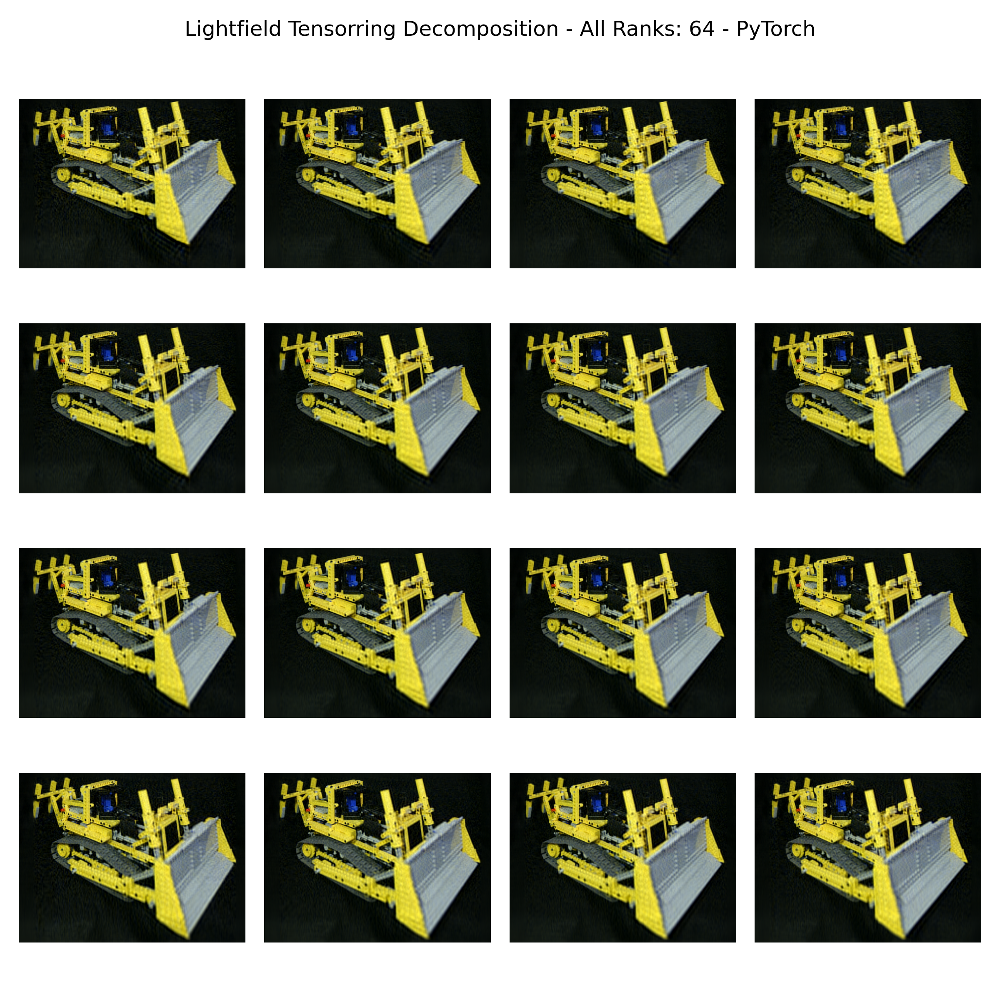
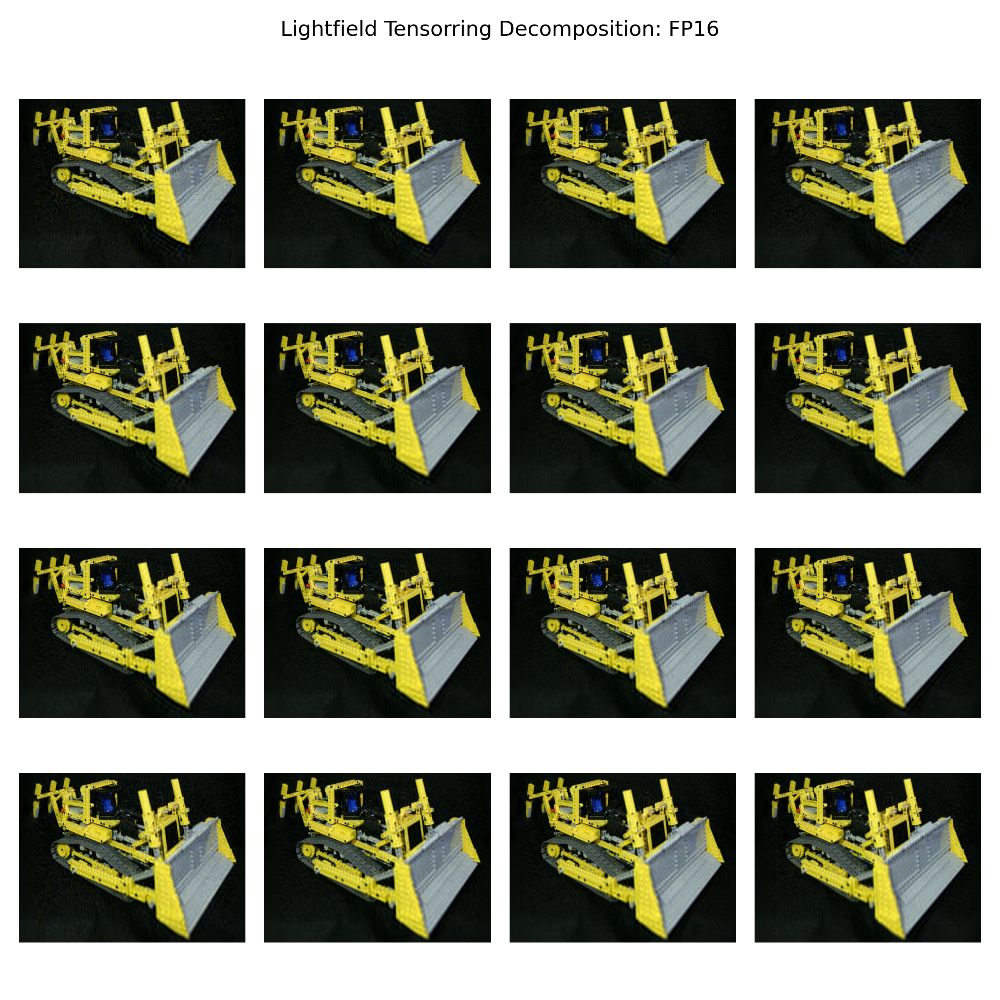

Task 1: PyTorch Reference Contraction
=======================================

Teilaufgabe a) – Index-Klassifikation
---------------------------------------

Einsum: ``acspx, bspy -> abcyx``

==========  =======================  ======
Index       Vorkommen                Typ
==========  =======================  ======
``a``       A, Output                **M**
``c``       A, Output                **M**
``x``       A, Output                **M**
``b``       B, Output                **N**
``y``       B, Output                **N**
``s``       A, B                     **K**
``p``       A, B                     **K**
==========  =======================  ======

Es gibt keine Batch-Dimension (C) – kein Index kommt in beiden Inputs
*und* im Output vor.

Teilaufgabe b) – torch.einsum
------------------------------

Einsum-String: ``acspx, bspy -> abcyx``

Die Tensoren werden von NumPy nach PyTorch konvertiert und auf die GPU
geschoben. Die Kontraktion wird einmal mit FP32-Inputs und einmal mit
FP16-Inputs (per ``.half()``) ausgeführt:

.. code-block:: python

   abcyx_fp32 = torch.einsum('acspx,bspy->abcyx', tensor_acspx, tensor_bspy)

   acspx_fp16 = tensor_acspx.half()
   bspy_fp16  = tensor_bspy.half()
   abcyx_fp16 = torch.einsum('acspx,bspy->abcyx', acspx_fp16, bspy_fp16)

Teilaufgabe c) – Visualisierung
---------------------------------

Zwischen FP32 und FP16 gibt es keinen sichtbaren Unterschied..

Vollständige Implementierung
----------------------------

.. literalinclude:: ../../../../assignments/06_assignment/src/main.py
   :language: python